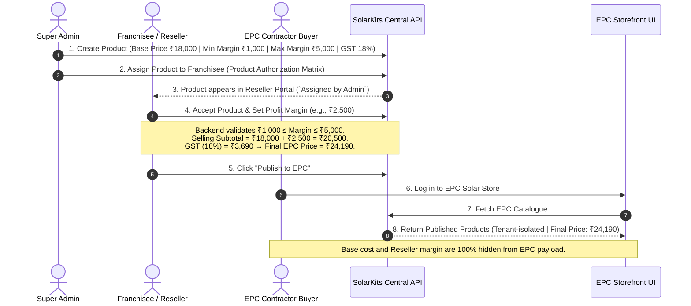
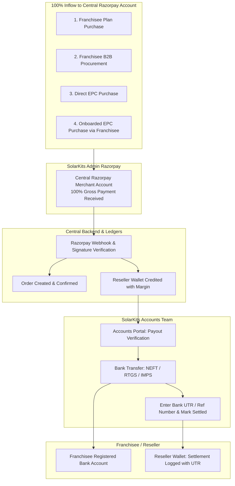

# SolarKits v2.0 — Enterprise B2B Solar E-Commerce & Distribution Ecosystem ☀️🔋

[](https://nodejs.org/)
[](https://react.dev/)
[](https://vitejs.dev/)
[](https://expressjs.com/)
[](https://mongoosejs.com/)
[](https://tailwindcss.com/)
[](https://razorpay.com/)

**SolarKits v2.0** is an enterprise-grade, multi-tenant B2B Solar E-Commerce, Channel Distribution, and Operations Ecosystem. It integrates B2B buyers, EPC contractors, regional franchisees/resellers, BOS distributors & dealers, warehouse logistics, financial accounts, and central administrators into a unified digital platform.

---

## 📑 Table of Contents

- [Platform Overview](#-platform-overview)
- [Repository Structure](#-repository-structure)
- [Applications & Portals](#-applications--portals)
  - [1. Central Backend Service](#1-central-backend-service-backendsolarkits-central-backend)
  - [2. Unified Internal Admin Portal](#2-unified-internal-admin-portal-internal-admin-portalsolarkits-unified-admin)
  - [3. Reseller & Franchisee Portal](#3-reseller--franchisee-portal-customer-appssolarkits-reseller-portal)
  - [4. Direct EPC Solar Store](#4-direct-epc-solar-store-customer-appssolar-store)
  - [5. SolarShop India Marketplace](#5-solarshop-india-marketplace-customer-appssolarkits-solarshop-india)
  - [6. BOSKIT B2B Platform](#6-boskit-b2b-platform-customer-appsboskit-website)
- [Core Business Architecture & Workflows](#-core-business-architecture--workflows)
  - [Franchisee Product Authorization & Pricing Flow](#-franchisee-product-authorization--pricing-flow)
  - [Centralized Payment & Settlement Engine](#-centralized-payment--settlement-engine)
- [Port & Service Reference](#-port--service-reference)
- [Tech Stack](#-tech-stack)
- [Getting Started & Local Setup](#-getting-started--local-setup)
- [Environment Configuration](#-environment-configuration)
- [Live Deployments & Demo Access](#-live-deployments--demo-access)
- [Security & Architecture Guardrails](#-security--architecture-guardrails)
- [License & Copyright](#-license--copyright)

---

## 🌟 Platform Overview

SolarKits powers the digital transformation of wholesale solar commerce, multi-tiered channel distribution, and EPC supply chains across India.

### 👥 Target Stakeholders & Modules:
- **B2B Solar EPC Contractors**: Procure customized solar combo kits, inverters, panels, mounting structures, and BOS equipment with tiered wholesale pricing.
- **Franchisees & Channel Resellers**: Subscribe to regional franchise plans, secure exclusive territory rights, procure inventory, customize margins, and publish products to onboarded EPC buyers.
- **BOS Distributors & Regional Dealers**: Manage specialized Balance of System (BOS) product kits, customize hardware packages, and manage sub-dealer networks.
- **Warehouse & Logistics Teams**: Oversee multi-warehouse inward stock, barcode/serial activation, real-time inventory allocation, and dispatch tracking.
- **Finance & Accounts Teams**: Manage double-entry ledgers, GST tax invoicing, payout verifications, and manual NEFT/RTGS commission settlements with UTR tracking.
- **Central Administrators**: Full governance over master catalogs, reseller authorization matrices, CMS theming, user roles, and system workflows.

---

## 🏗️ Repository Structure

```text
SolarKits v2.0/
├── backend/
│   └── solarkits-central-backend/          # Central REST API Service (Express 5 + Mongoose + Node.js)
│       └── src/
│           ├── index.js                    # Server bootstrap & Global route registrations
│           ├── config/ & keys/             # Database connections & RSA/JWT key configs
│           ├── utils/                      # Schedulers, Cron jobs, Auto-seeders
│           └── modules/                    # Domain-driven modular architecture
│               ├── cms-auth/               # Centralized SSO & Role authentication
│               ├── admin-panel/            # Super Admin masters, Resellers, Products, Territory
│               ├── account-panel/          # Ledgers, GST Invoices, Payout & UTR settlement
│               ├── warehouse-panel/        # Multi-warehouse inventory, Stock Inward, Serials
│               ├── operation-management/   # Order dispatch, Logistics & Ticket routing
│               ├── developer-panel/        # Dynamic module toggles, Health & Diagnostics
│               ├── supplier-panel/         # Supplier onboarding, Brand catalog & Bids
│               ├── AMC-panel/              # Annual Maintenance Contracts & EPC service plans
│               ├── solarshop-india/        # B2B Store API, Cart & Razorpay Checkout Engine
│               ├── boskit/                 # BOSKIT Platform (Distributor & Dealer engine)
│               └── solarkits-website/      # Corporate Website CMS & Theming API
│
├── customer-apps/
│   ├── solarkits-reseller-portal/          # Franchisee & Reseller Portal (React 19 + Tailwind v4 + Vite)
│   ├── solar-store/                        # Direct EPC B2B Solar Storefront (React 19 + Redux + Vite)
│   ├── solarkits-solarshop-india/          # Solar Marketplace UI (React 19 + Redux + Vite)
│   └── boskit-website/                     # BOSKIT Distributor & Dealer Platform (React 19 + Vite)
│
├── internal-admin-portal/
│   └── solarkits-unified-admin/            # Unified Multi-Portal Staff Application (React 19 + Redux + Vite)
│       └── src/portals/
│           ├── cms-auth/                   # Multi-role Gateway & SSO Login
│           ├── admin/                      # Super Admin Dashboard & System Masters
│           ├── accounts/                   # Finance, Tax Invoices & UTR Commission Payouts
│           ├── warehouse/                  # Inventory Control, Stock Inward & Serial Tracking
│           ├── operations/                 # Order Dispatch & Project Management
│           ├── developer/                  # Module Configuration & System Diagnostics
│           ├── reseller/                   # Reseller Management & Partner Workspaces
│           └── boskit/                     # BOSKIT Master Admin & Regional Distributor Portal
│
├── Dockerfile                              # Multi-stage Containerization Build File
├── nginx.conf                              # Local Reverse Proxy Configuration (Port 5176)
├── nginx.prod.conf.template                # Production NGINX Deployment Template
├── start.sh                                # Production Startup Script
├── payment_documentation.md                # Razorpay & Commission Accounting Technical Spec
└── admin_product_reseller_epc_guide.md     # Super Admin Reseller & EPC Lifecycle Guide
```

---

## ⚡ Applications & Portals

### 1. Central Backend Service (`backend/solarkits-central-backend`)
- **Port:** `5000` (or `3000`)
- **Core Engine:** Node.js, Express.js 5, MongoDB (Mongoose 9.x)
- **Key Modules:**
  - `/auth-api`: Centralized Auth, JWT refresh/access token rotation, cookie session management.
  - `/admin-api` & `/api`: Master catalog, Brands, Products, Geolocation/Territory, Reseller Management Matrix, EPC approvals, Industry theming.
  - `/api/india/v1`: SolarShop & EPC Storefront API, Combo Kits, BOS Kits, Custom Configurator, Bulk Buying, Cart, Centralized Razorpay Gateway, 30s Live Inventory Polling.
  - `/api/boskit/v1`: BOSKIT Platform APIs for master distributors, sub-dealers, customizable hardware packs, and margin allocation.
  - `/account-api`: Finance & Accounts, GST invoicing, Double-Entry Wallet audit, Manual Commission Payout with UTR tracking.
  - `/warehouse-api`: Multi-warehouse inventory, Stock Inward logs, SKU serial assignment, stock movement.
  - `/operation-management-api`: Order dispatch, tracking, and operational tasks.
  - `/developer-api`: Diagnostic routes, dynamic module activation, panel management.

### 2. Unified Internal Admin Portal (`internal-admin-portal/solarkits-unified-admin`)
- **Port:** `5174` (or `5176` via Nginx)
- **Tech:** React 19, Redux Toolkit, Tailwind CSS v4, Lucide Icons, Framer Motion
- **Sub-Portals:**
  - **Admin Portal (`/admin-panel/*`)**: Full catalog control, SKU pricing, Franchisee Authorization Matrix, EPC partner approvals, Industry CMS.
  - **Accounts Portal (`/account-panel/*`)**: GST invoice generation, double-entry wallet tracking, Franchisee commission payout recording (NEFT/RTGS/IMPS + UTR Number).
  - **Warehouse Portal (`/warehouse/*`)**: Warehouse inventory, stock inward logs, barcode/serial assignment, delivery logistics.
  - **Operations Portal (`/operation-management-panel/*`)**: Order lifecycle, dispatch status, customer support ticketing.
  - **BOSKIT Admin (`/boskit-admin/*`)**: BOSKIT master catalog, distributor assignments, and dealer policy management.
  - **Developer Portal (`/developer-panel/*`)**: Dynamic module configurator and system health logs.

### 3. Reseller & Franchisee Portal (`customer-apps/solarkits-reseller-portal`)
- **Port:** `5178`
- **Tech:** React 19, React Router v7, Tailwind CSS v4, Framer Motion
- **Key Features:**
  - **Franchise Plans:** Tiered membership tiers (Bronze, Silver, Gold, Platinum) with online Razorpay subscription & Bank Details capture (Account No, IFSC, Bank Name).
  - **KYC Workspace:** GST, PAN, Aadhaar upload with Quick eKYC verification.
  - **Territory Rights:** District/Pincode exclusivity management.
  - **Authorized Catalog & Margin Setup:** View products assigned by Super Admin, configure reseller margin within Admin-defined limits (`Min Margin ≤ Reseller Margin ≤ Max Margin`).
  - **Storefront Listings:** One-click product publishing to onboarded EPC buyers.
  - **EPC Buyers Management:** Onboard, manage, and view orders from affiliated EPC contractors.
  - **Franchisee Wallet:** Real-time earnings ledger, settlement status, and Admin UTR payment confirmation logs.

### 4. Direct EPC Solar Store (`customer-apps/solar-store`)
- **Port:** `5177` (or `5173`)
- **Tech:** React 19, Redux Toolkit, Tailwind CSS v3, Headless UI, Framer Motion
- **Key Features:**
  - **Preconfigured Solar Combo Kits:** Turnkey kits for Residential (1kW–10kW), Commercial (10kW–50kW), and Industrial rooftop projects.
  - **Custom Combo Kit & BOS Kit Builders:** Interactive component configurator with real-time price and technical validation.
  - **Live Inventory Polling:** Automatic 30-second live inventory polling against regional warehouse stock.
  - **Bulk Buying:** Tiered volume pricing for bulk solar procurement.
  - **Store Locator (`/store-locator`):** Geo-aware multi-district store and warehouse locator.
  - **Tenant-Isolated EPC Catalog:** Logged-in EPC buyers see products published by their assigned Franchisee with clean, confidential final pricing (Admin cost prices and margins are 100% hidden).

### 5. SolarShop India Marketplace (`customer-apps/solarkits-solarshop-india`)
- **Port:** `5173`
- **Tech:** React 19, Redux Toolkit, Tailwind CSS v4
- **Key Features:**
  - B2B solar marketplace for direct buyers, quote generator, tiered trade pricing, and multi-brand catalogs.

### 6. BOSKIT B2B Platform (`customer-apps/boskit-website`)
- **Port:** `5180`
- **Tech:** React 19, Tailwind CSS v4, Lucide Icons
- **Key Features:**
  - **Distributor Portal (`/distributor/portal`):** Procurement catalog, Custom BOS Kits, Combo Kits, Dealer Margin configuration, Sub-dealer applications, and Territory mapping.
  - **Dealer Portal (`/dealer/portal`):** Dedicated dealer catalog, cart, checkout, and regional distributor hub connectivity.
  - **Public BOSKIT Platform:** Programs for Master Distributors and Authorized Regional Dealers.

---

## 💼 Core Business Architecture & Workflows

### 🏷️ Franchisee Product Authorization & Pricing Flow



---

### 💳 Centralized Payment & Settlement Engine

SolarKits v2.0 implements a **100% Centralized Admin Payment Inflow** + **Manual Bank Settlement (NEFT/RTGS/IMPS)** model:



1. **100% Centralized Inflow:** Every transaction (Plans, B2B procurement, EPC retail) flows entirely into SolarKits Admin's Razorpay Account.
2. **Double-Entry Wallet:** Franchisee commissions are computed and credited to their digital ledger in `ResellerWallet`.
3. **Manual Bank Settlement:** The Accounts team reviews pending payouts and executes standard bank transfers (NEFT/RTGS/IMPS) to the partner's verified bank account.
4. **UTR Recording:** The Accounts executive enters the Bank UTR reference number in the portal, instantly updating the partner's wallet ledger with proof of settlement.

---

## 🔌 Port & Service Reference

| Service / App | Directory | Default Port | Primary Purpose |
| :--- | :--- | :--- | :--- |
| **Central Backend** | `backend/solarkits-central-backend` | `5000` / `3000` | Central REST API, Auth, Razorpay, Ledgers, Mongo DB |
| **Unified Admin Portal** | `internal-admin-portal/solarkits-unified-admin` | `5174` | Super Admin, Accounts, Warehouse, Operations, BOSKIT Admin |
| **Reseller Portal** | `customer-apps/solarkits-reseller-portal` | `5178` | Franchisee Onboarding, Territory, Margin Setup, EPC Management |
| **Direct EPC Solar Store** | `customer-apps/solar-store` | `5177` / `5173` | B2B EPC Store, Combo Kits, BOS Builder, Live Polling, Cart |
| **SolarShop India** | `customer-apps/solarkits-solarshop-india` | `5173` | B2B Solar Marketplace Storefront |
| **BOSKIT Platform** | `customer-apps/boskit-website` | `5180` | Balance of System Distributor & Dealer Ecosystem |
| **Dev Nginx Proxy** | Root (`nginx.conf`) | `5176` | Unified reverse proxy routing all sub-apps on single host |

---

## 🛠️ Tech Stack

- **Frontend Frameworks:** React 19, Vite 7, React Router v7, Redux Toolkit
- **UI & Styling:** Tailwind CSS (v3.4 / v4.1), Framer Motion, Lucide Icons, React Icons, Headless UI
- **Backend Architecture:** Node.js (v18+ / v22), Express.js 5, MongoDB (Mongoose 9.x)
- **Payment & Fintech:** Razorpay SDK (Standard Checkout + Idempotent Webhook Verification), Double-Entry Accounting Ledger Engine
- **Cloud & Communications:** Cloudinary (Media Assets), Nodemailer (SMTP), Twilio (SMS & WhatsApp OTP)
- **Security & Guardrails:** NoSQL Injection Sanitization (`mongo.sanitize`), Rate Limiting, Signed httpOnly Cookies, RSA/JWT Auth
- **DevOps & Containerization:** Multi-stage Dockerfile, Nginx Reverse Proxy, Linux Alpine

---

## 🚀 Getting Started & Local Setup

### Prerequisites
- **Node.js**: v18.x or v22.x LTS
- **MongoDB**: Local instance running on `mongodb://localhost:27017` or MongoDB Atlas URI
- **Git**

### 1. Clone & Setup Backend

```bash
cd "d:/Company_project/SolarKits v2.0/backend/solarkits-central-backend"

# Install dependencies
npm install

# Configure environment
cp .env.example .env
# Fill in MongoDB URI, JWT Secrets, Razorpay Keys in .env

# Run backend development server (Port 5000)
npm run dev
```

### 2. Run Reseller / Franchisee Portal

```bash
cd "d:/Company_project/SolarKits v2.0/customer-apps/solarkits-reseller-portal"
npm install
npm run dev
# Running on http://localhost:5178
```

### 3. Run Direct EPC Solar Store

```bash
cd "d:/Company_project/SolarKits v2.0/customer-apps/solar-store"
npm install
npm run dev
# Running on http://localhost:5177 (or http://localhost:5173)
```

### 4. Run Unified Internal Admin Portal

```bash
cd "d:/Company_project/SolarKits v2.0/internal-admin-portal/solarkits-unified-admin"
npm install
npm run dev
# Running on http://localhost:5174
```

### 5. Run BOSKIT Platform (Optional)

```bash
cd "d:/Company_project/SolarKits v2.0/customer-apps/boskit-website"
npm install
npm run dev
# Running on http://localhost:5180
```

---

## 🔒 Environment Configuration

### Backend `.env` Configuration Reference

```env
# Server
PORT=5000
IPV4=http://localhost
NODE_ENV=development

# Database
MONGODB_URI=mongodb://localhost:27017/solarkits-project
# Or Atlas: mongodb+srv://<user>:<password>@cluster.mongodb.net/solarkits

# CORS Allowed Origins
FRONTEND_URLS=http://localhost:5173,http://localhost:5174,http://localhost:5175,http://localhost:5177,http://localhost:5178,http://localhost:5180

# Authentication & JWT
JWT_ACCESS_SECRET=your_super_secret_access_key
JWT_REFRESH_SECRET=your_super_secret_refresh_key
ACCESS_TOKEN_EXPIRY=15m
REFRESH_TOKEN_EXPIRY=2d

# Cloudinary Assets
CLOUDINARY_CLOUD_NAME=your_cloud_name
CLOUDINARY_API_KEY=your_api_key
CLOUDINARY_API_SECRET=your_api_secret

# Razorpay Payment Gateway (Central Inflow)
RAZORPAY_ID=rzp_test_your_key_id
RAZORPAY_KEY=your_razorpay_key_secret
RAZORPAY_WEBHOOK_SECRET=your_webhook_secret

# Email & Notifications
NODEMAILER_HOST=smtp.gmail.com
NODEMAILER_PORT=465
NODEMAILER_SECURE=true
NODEMAILER_USER=your_email@example.com
NODEMAILER_PASS=your_app_password
EMAIL_FROM=your_email@example.com

# Quick eKYC (GST & Identity Verification)
QUICKEKYC_PROVIDER=mock # mock | sandbox | production
```

---

## 🌐 Live Deployments & Demo Access

### 🔗 Live Production / Staging URLs

| Service | Live URL |
| :--- | :--- |
| **Unified Admin Portal** | [https://solarkits-unified-admin.onrender.com](https://solarkits-unified-admin.onrender.com) |
| **Reseller & Franchisee Portal** | [https://solarkits-reseller-portal.onrender.com](https://solarkits-reseller-portal.onrender.com) |
| **SolarShop India** | [https://solarkits-solarshop-india.onrender.com](https://solarkits-solarshop-india.onrender.com) |

### 🔑 Default Demo & Test Accounts

#### 1. EPC Contractor Login (Solar Store)
- **Login URL:** `http://localhost:5177/auth/login` (or `http://localhost:5173/auth/login`)
- **Email / Phone:** `samir@gmail.com` *(or Mobile: `9874561230`)*
- **Password:** `1234`

#### 2. Franchisee / Reseller Login
- **Login URL:** `http://localhost:5178/login`
- **Email / Phone:** Franchisee registered email or phone
- **Features:** KYC workspace, Territory, Margin manager, Bank account details, Wallet payouts.

#### 3. Super Admin & Staff Portal
- **Login URL:** `http://localhost:5174/` (Unified Gateway)
- **Role Selection:** Super Admin / Accounts / Warehouse / Operations / Developer / BOSKIT Admin

---

## 🛡️ Security & Architecture Guardrails

1. **NoSQL Injection Prevention**: Active `mongo.sanitize` middleware strips `$` and `.` operators from all incoming `req.body`, `req.params`, and `req.query` payloads.
2. **Confidential B2B Pricing Isolation**: EPC endpoints never receive reseller purchase prices, base manufacturer costs, or margin limits in API responses.
3. **Double-Entry Wallet Audit**: Reseller wallets maintain strict immutable ledger records with pending and settled states tied to verified bank UTRs.
4. **Idempotent Webhook Verification**: Razorpay payment webhooks use SHA-256 HMAC signature validation to prevent replay attacks or duplicate order fulfillment.
5. **Secure Asset Storage**: Cloudinary integration for secure, optimized product image delivery and private KYC document management.

---

## 📜 License & Copyright

© 2026 **SolarKits Technologies Pvt. Ltd.** All Rights Reserved.  
*Enterprise B2B Solar E-Commerce, Channel Distribution & Operations Ecosystem.*