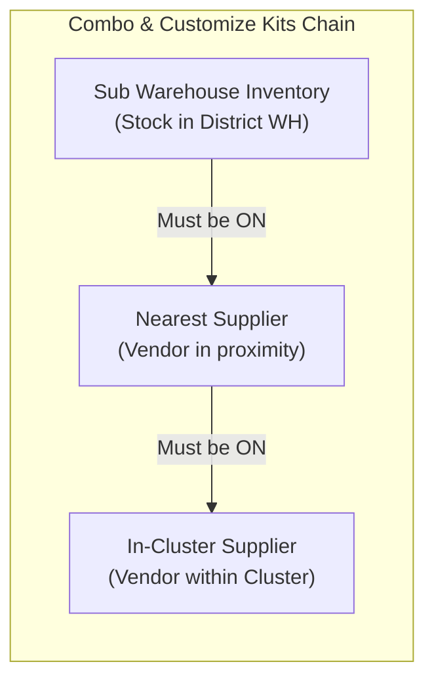
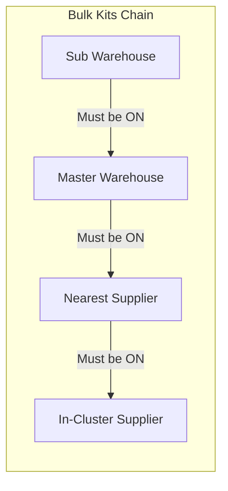

# SolarKits - Kit Activation & Order Management Settings Logic ⚡

Yeh document SolarKits codebase me **Kit Activation System** aur **Order Management Settings** ke pure logic ko simple language (Hinglish + Technical details) me explain karta hai.

---

## 📌 Executive Summary (Kits Activation Kya Hai?)

SolarKits platform par koi bhi Solar Kit (Combo Kit, Customize Kit, ya Bulk Kit) directly kisi customer ya EPC partner ko tab tak sell nahi ho sakti jab tak wo **2 Levels** par activate aur configure na ho:

```
[ Solar Kit Blueprint ]
         │
         ▼
[ Step 1: Warehouse Level Activation ] ──> Kit pricing, margins, and warehouse activation
         │
         ▼
[ Step 2: District Order Management ]  ──> Channel toggles (Sub-Warehouse -> Nearest -> In-Cluster)
         │
         ▼
[ Customer / EPC Portal (SolarShop) ]   ──> Kit visible & orderable with sequential fulfillment
```

---

## 🏗️ Pure System ke 2 Main Stages

1. **Stage 1: Warehouse Kit Activation (`ADM_WH_KIT_ACT`)**
   - Location: `Solar Shop -> Warehouse Kit Activations`
   - Files:
     - Frontend: [`WarehouseKitConfig.jsx`](file:///d:/Company_project/LIVE_DOMAIN_WEBSITE/SolarKits%20v2.0/internal-admin-portal/solarkits-unified-admin/src/portals/admin/pages/solar-shop/warehouse-kit-activations/WarehouseKitConfig.jsx)
     - Backend Handler: [`warehouse_kit_activations.handler.js`](file:///d:/Company_project/LIVE_DOMAIN_WEBSITE/SolarKits%20v2.0/backend/solarkits-central-backend/src/modules/admin-panel/controller/solarshop/warehouse_kit_activations.handler.js)
     - DB Model: [`warehouse_kit_activations.schema.js`](file:///d:/Company_project/LIVE_DOMAIN_WEBSITE/SolarKits%20v2.0/backend/solarkits-central-backend/src/modules/admin-panel/models/core_db/warehouse_kit_activations.schema.js)

2. **Stage 2: District Order Management Settings (Jo Screenshot me dikhaya gaya hai)**
   - Location: `Solar Shop -> Order Management Settings`
   - Files:
     - Frontend: [`OrderManagementSettings.jsx`](file:///d:/Company_project/LIVE_DOMAIN_WEBSITE/SolarKits%20v2.0/internal-admin-portal/solarkits-unified-admin/src/portals/admin/pages/solar-shop/order-management-settings/OrderManagementSettings.jsx)
     - Backend Handler: [`order_settings.handler.js`](file:///d:/Company_project/LIVE_DOMAIN_WEBSITE/SolarKits%20v2.0/backend/solarkits-central-backend/src/modules/admin-panel/controller/solarshop/order_settings.handler.js)
     - DB Model: [`order_settings.schema.js`](file:///d:/Company_project/LIVE_DOMAIN_WEBSITE/SolarKits%20v2.0/backend/solarkits-central-backend/src/modules/admin-panel/models/core_db/order_settings.schema.js)

---

## 🔍 Stage 1: Warehouse Level Kit Activation Logic

Kisi bhi warehouse ke andar kisi kit ko switch ON (Active) karne se pehle system **3 Hard Prerequisites (Validation Gates)** check karta hai:

### 1. Hard Prerequisites (Validation Gates):
| Prerequisite | Kyun Zaroori Hai? | Agar Missing Ho To Kya Hota Hai? |
| :--- | :--- | :--- |
| **1. SKU Benchmark Prices** | Kit me jitne bhi SKUs hain (Solar Panels, Inverters, Structures, Cables, BOS), un sabki price us warehouse ke linked **Cluster** me set honi chahiye. | Toggle **LOCKED** ho jayega. Click karne par error aayega: `X SKU(s) missing benchmark prices`. Saath me SKU setup karne ka direct link milta hai. |
| **2. Company Profit Margin** | Company ka profit margin us specific Kit aur Warehouse ke liye set hona zaroori hai. | Error: `Company margins are not configured for this kit in this warehouse`. Direct link: `Configure Margin`. |
| **3. GST Rate Configuration** | Company Margin ke andar GST rate configure hona compulsory hai. | Error: `GST rate is not configured for this kit margin`. Direct link: `Configure GST & Margin`. |

> **Backend Check Logic (`warehouse_kit_activations.handler.js`):**
> Jab admin Toggle switch dabaata hai ya Bulk Save karta hai, backend checks run hote hain:
> - `checkAllSkusHavePrices(kit, warehouse_id)`
> - `checkCompanyMarginIsSet(combo_kit_id, warehouse_id)`
> - `getCompanyMarginGstConfig(combo_kit_id, warehouse_id)`
>
> Agar ek bhi fail hua, to backend se **HTTP 400 error** return hota hai aur kit activate nahi ho sakti.

### 2. Auto-Deactivation Cascade Rule:
- Agar kisi Combo Kit ko warehouse me **Deactivate (OFF)** kiya jata hai:
  - Us kit ke **Bulk Kit Settings** (`bulk_kit_settings`) bhi automatically **OFF / Disabled** ho jate hain (`autoDeactivateBulkKit`).
  - Reason: Bina active Combo Kit ke Bulk Kit bechna business logic ke khilaf hai.

---

## 🎛️ Stage 2: District Order Management Settings (Aapke Screenshot Wala Screen)

Jab Warehouse me kit activate ho jaati hai, tab admin **Order Management Settings** par aata hai yeh decide karne ki kisi particular **District** me wo kit customer ko **kaun-kaun se fulfillment channels** se mil sakti hai.

### 1. Scope Selection (Hierarchy Dropdowns)
Admin select karta hai:
`Country` ➔ `State` ➔ `Cluster` ➔ `District` (Jaise aapke screenshot me: Gujarat -> Central Gujarat -> Ahmedabad).

### 2. Kit Loading Rule & Master Warehouse Fallback:
Jab aap koi District select karte hain, backend yeh steps follow karta hai:
1. **District Warehouses Search:**
   - Pehle check karta hai ki kya is District (`level_2`) me company ka koi warehouse hai?
2. **Master Warehouse Fallback (Smart Rule):**
   - Agar us district me koi warehouse **NAHI** hai, to system us Cluster ke **Master Warehouse** ko find karta hai.
   - Master Warehouse me jo kits activated hain, unhe screen par load karta hai.
   - UI par yellow alert notice aata hai:
     > *"This district does not have any local warehouses. Showing activated kits from the Master Warehouse (WH-CODE) of this cluster."*
3. **Empty State:**
   - Agar na to district me warehouse hai aur na hi cluster me master warehouse, ya warehouse me koi kit activated nahi hai, to screen par aata hai:
     > *"No Activated Kits Found. Activate kits under 'Warehouse Kit Activations' first."*

---

## ⛓️ Sequential Pipeline Chains (The Core Toggle Logic)

Screenshot me jo table hai, usme switches random ON/OFF nahi kiye ja sakte. Yeh **Strict Pipeline Dependency Chain** follow karte hain:





### A. Combo Kits & Customize Kits Tabs:
Yaha 3 channels hote hain:
1. **Sub Warehouse Inventory** (Channel 1)
2. **Nearest Supplier** (Channel 2)
3. **In-Cluster Supplier** (Channel 3)

**Enforced Rules:**
- `Sub Warehouse Inventory` **ACTIVE** hona compulsory hai `Nearest Supplier` ko enable karne ke liye.
- `Nearest Supplier` **ACTIVE** hona compulsory hai `In-Cluster Supplier` ko enable karne ke liye.
- **Reverse Cascade:** Agar aap `Sub Warehouse Inventory` ko **OFF** kar dete hain, to `Nearest Supplier` aur `In-Cluster Supplier` automatically **OFF** ho jayenge!

### B. Bulk Kits Tab:
Bulk orders ke liye ek extra channel hota hai (**Master Warehouse**):
1. **Sub Warehouse Inventory**
2. **Master Warehouse Inventory**
3. **Nearest Supplier**
4. **In-Cluster Supplier**

**Enforced Rules:**
- `Sub Warehouse` ON hoga tabhi `Master Warehouse` ON ho sakega.
- `Master Warehouse` ON hoga tabhi `Nearest Supplier` ON ho sakega.
- `Nearest Supplier` ON hoga tabhi `In-Cluster Supplier` ON ho sakega.

### C. PO Registered Kits Order Tab:
- Currently marked as **Phase 2 Implementation** (Future release ke liye locked hai).

---

## 🛒 Stage 3: Customer / EPC Shop (SolarShop India) Par Iska Asar

Jab customer ya EPC contractor website ya app (`solarshop-india`) par aata hai:

```
[ Customer Enters Pincode/District ]
                 │
                 ▼
[ Match District to Company Warehouse ]
                 │
                 ▼
[ Query WarehouseKitActivation (is_combokit_active = true) ]
                 │
        ┌────────┴────────┐
        ▼                 ▼
   Kit Active?        Kit Inactive?
        │                 │
        ▼                 ▼
  Show in Catalog   Hide / Unavailable
        │
        ▼
[ Checkout / Order Routing ]
        │
        ├─> Step 1: Check Sub Warehouse Physical Stock
        ├─> Step 2: If no stock & "Nearest Supplier" = ON ──> Route to Nearest Supplier
        └─> Step 3: If still no stock & "In-Cluster Supplier" = ON ──> Route to In-Cluster Supplier
```

1. **Catalog Filtering:**
   - [`shop.handler.js`](file:///d:/Company_project/LIVE_DOMAIN_WEBSITE/SolarKits%20v2.0/backend/solarkits-central-backend/src/modules/solarshop-india/controller/v1.handlers/shop.handler.js) me check hota hai:
     ```javascript
     const activations = await WarehouseKitActivation.find({
       warehouse_id: { $in: warehouseIds },
       is_combokit_active: true,
       is_active: true,
       deleted_at: null
     });
     ```
   - Sirf wahi kits shop par dikhte hain jinki activation aur pricing valid hai.

2. **Order Fulfillment:**
   - Order aane par pipeline checks ke hisab se order route hota hai: local warehouse stock pehle use hota hai; agar waha nahi hai to authorized nearest vendor se dispatch initiate hota hai.

---

## 📊 Database Schema Reference

### 1. `warehouse_kit_activations`
Stored in: `solarkits_core_db`
```json
{
  "_id": "ObjectId",
  "warehouse_id": "ObjectId (ref: company_warehouses)",
  "combo_kit_id": "ObjectId (ref: pc_comobo_kit)",
  "is_combokit_active": true,       // Combo kit active status
  "is_customize_kit_active": false, // Customize kit active status
  "base_price_cached": 150000,
  "selling_price_cached": 175000,
  "is_active": true,
  "deleted_at": null
}
```

### 2. `order_settings`
Stored in: `solarkits_core_db`
```json
{
  "_id": "ObjectId",
  "country_id": "ObjectId",
  "state_id": "ObjectId",
  "cluster_id": "ObjectId",
  "district_id": "ObjectId",
  "combo_kit_id": "ObjectId",
  "kit_type": "combo",              // "combo" | "customize" | "bulk"
  "sub_warehouse_active": true,     // Channel 1
  "master_warehouse_active": false, // Channel 2 (Bulk only)
  "nearest_supplier_active": true,  // Channel 3
  "in_cluster_supplier_active": false, // Channel 4
  "is_active": true
}
```

---

## 💡 Quick Summary Checklist (Troubleshooting)

Agar koi kit **Order Management Settings** me nahi dikh rahi ya toggle ON nahi ho rahi:

1. **Kit kyu nahi dikh rahi table me?**
   - 👉 Check karein ki kya us District ke Warehouse me kit ko `Warehouse Kit Activations` se activate kiya gaya hai?
   - 👉 Agar district me warehouse nahi hai, to kya Cluster ke Master Warehouse me kit activate hai?

2. **Toggle ON kyu nahi ho raha?**
   - 👉 Dependency check karein: Agar aap `Nearest Supplier` ON karna chahte hain, to pehle `Sub Warehouse Inventory` ON hona chahiye.
   - 👉 Admin write permissions check karein (`hasEditPermission`).

3. **Warehouse Kit Activation me toggle LOCKED kyu hai?**
   - 👉 Red color me error dekhein:
     - Kya sabhi SKUs ki price Cluster level par add hai?
     - Kya Company Margin aur GST rate configure hai?
     - In links par click karke missing configuration complete karein, fir lock open ho jayega.
